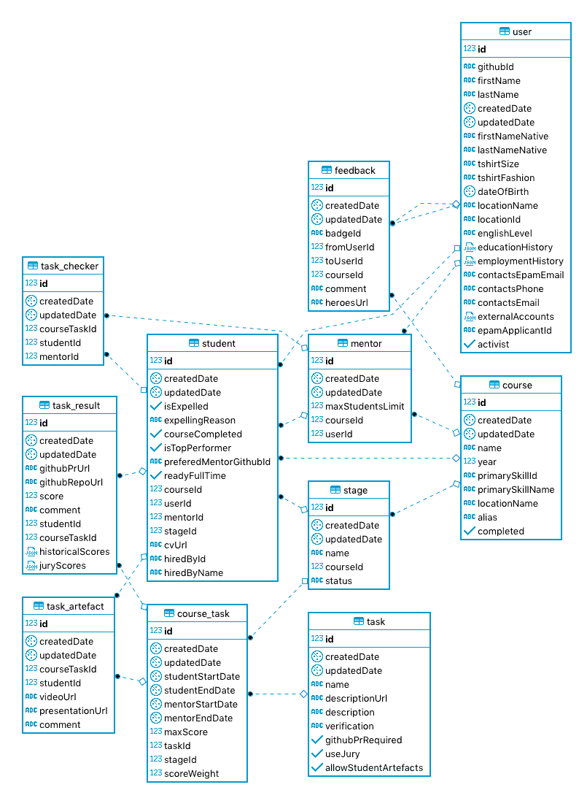

## Purposes

During for a long time **"Rolling Scopes School"** has been taught people to **Front-End** development.
Our community is continuously growing and It is harder and harder to control and maintain a studying process.
So it was decided to create a platform which will help to solve these problems.

## Overview

Now let's discuss a domain.  
Look on the following picture:

There is an entity which is called **User**. It's just a some real person.
**User** can play different roles. For example someone decided to be a developer. He joined to the some rsschool **Course**. During that **Course** he was a **Student**. After some time this guy decided to pass its knowledge to other and participate in the new rsschool course as a **Mentor**. One person, but different roles. Do you see? Let's move on. Let's discuss a learning process.  
After joining to the **Course** **Student** begins to perform **Tasks**. Every **Task** is an independent entity. It's a real life situation when some **Tasks** repeat from **Course** to **Course**. But for identification in scope of concrete **Course** there is **Course_task**. It's matter because every **Task** should have start, end date, max score, etc and these values may change from course to course. There are specific tasks which can have additional information(e.g. links to the video/presentations), **Task_artefact**. After checking by **Mentor** **Task** will be linked with particular **Task_result**. During the **Course** of the **Student's** studies there will be **Stages**. It's something like study semesters in the real life. So every **Stage** has specific **Tasks**. For example in the middle of education every student should pass "JS Core interview" and it was decided that the interviewer must be the person who is not the mentor of the student(there are many reasons for that), so we have **Task_checker**. In simple terms It's a link mentor-task-student.  
In addition every **User** in a system can receive **Feedback**. By the end of the course, after helping to someone, etc(this concept has many advantages).

## Facilities

Our application is actively developed.
Currently it has the following facilities:

    TBD
    1. From the student side:
        - See a score
        - See mentors contacts
    2. From the mentor side:
        - Send the task score
        - Expel a student

For understanding our plans you can explore a [backlog](../backlog).
