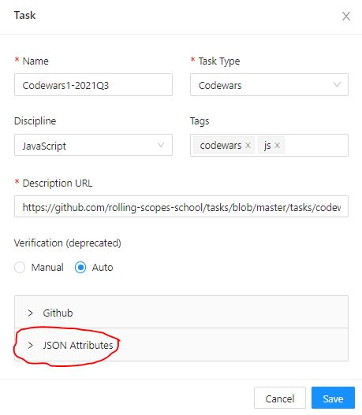
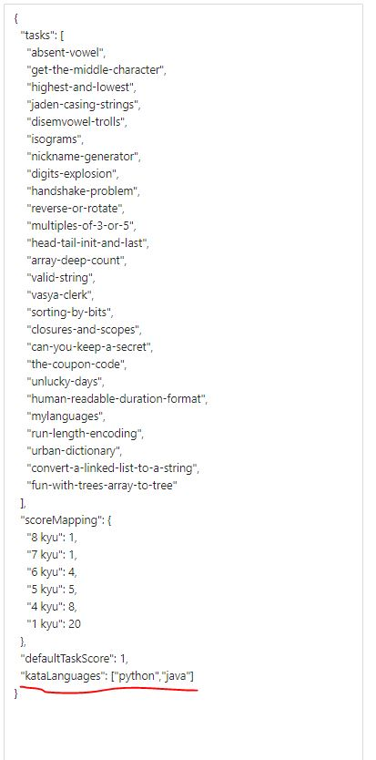

# Choose kata language

A small feature that provides additional option to the `codewars` tasks. 
To count only katas that were solved in a specific language, the `kataLanguages` ​​property containing an `array` of allowed languages ​​must be passed to the `JSON attributes` of the task.
You can configure `JSON attributes`  to the settings of a specific task.

For the task with `JSON attributes` ​​from the example below, only solutions in `Python` and `Java` will be counted.

If `kataLanguages` ​​is not passed, then kata solved in `Javascript` or `Typescript` are counted.
