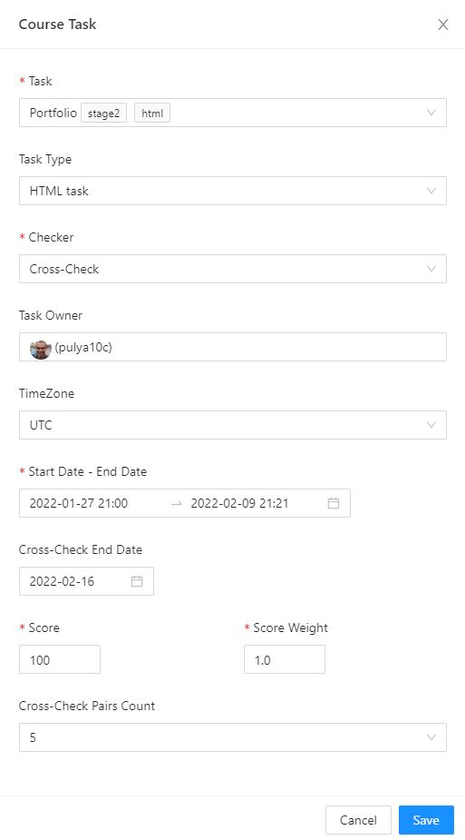

# Cross Check Scheduling

This functionality allows you to automatically **distribute** a Cross-Check and **complete** it. The distribution buttons for manual Cross-Check distribution and completion are also still available.

The functionality for starting and ending a Cross-Check complements the existing one.
Now Cross-Check starts **automatically after the deadline date**. The crosscheck completion date is set when a `CourseTask` is created or when it is edited from the menu on the `course/admin/tasks?course={courseAlias}` page.

The end date of the Cross-Check is set up to a day.

For example, setting the date to **03/20/2022** means that the Cross-Check deadline is **23:59 03/20/2022 +00 UTC**.

Everyday Cross-Check functionality at the beginning of the day starts 2 jobs:

- Finds tasks that have passed the submission deadline and that have not yet been distributed and distributes them.
- Finds tasks that have already been distributed and whose Cross-Check deadline has ended and completes the Cross-Check.

To track the status of a task, the CourseTask entity has been extended with 2 new properties:

- `crossCheckState` - displays the current status of the task. Includes the following options:
  - **initial** - task submission deadline has not yet ended and it has not been distributed
  - **distributed** - task has been distributed for Cross-Check, the Cross-Check deadline has not yet arrived
  - **completed** - Cross-Check deadline has ended, the cross-check of the task has been completed
- `crossCheckEndDate` - datestring with planned Cross-Check deadline date

NB! For switching between dev and prod hosts there's `RSSCHOOL_USE_PROD_HOST` environment variable in `nestjs` `.env` file. Don't forget to set it `true` if you want to use this feature on production.
