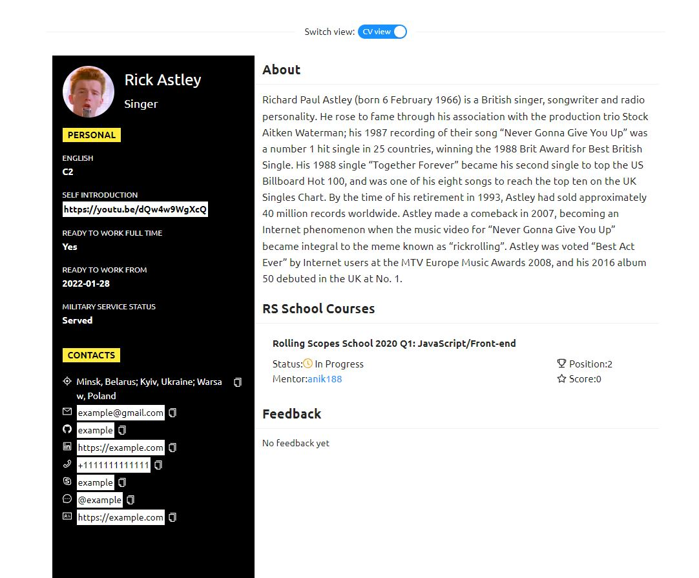
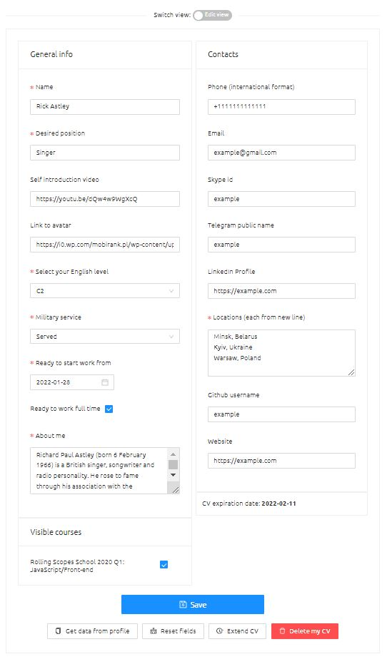
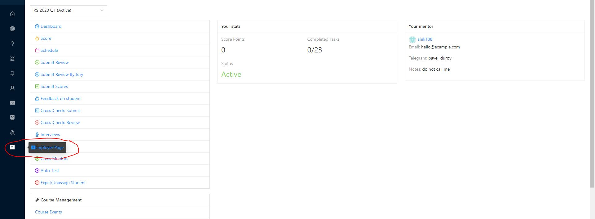

# CV

RsApp CV is a 2-part functionality:
* For users who want to find a job it helps create their own resume and present it to a potential employer
* For employers who want to find an employee it grants access to user's resumes. 

## Part 1: CV

User can get access to the CV from the dropdown menu in the header, or by following the link `app.rs.school/cv?githubid=<github id of the CV owner>`

<kbd></kbd>

To start work with CV, user needs to log in and follow the link `app.rs.school/cv?githubid=<github id of the CV owner>`

<kbd></kbd>

There user will be asked to give his consent to the use of user data, after which the CV will become available to user (but not yet available to employers).

<kbd></kbd>

CV has 2 views: `View` and `Form`.
View is the “front” side of the CV and displays the available information, `Form` allows user to add, modify and delete user information in the CV.

This is how CV `View` looks like:

<kbd></kbd>

There are 2 types of data presented in the CV:
* Information that the user can freely change directly
    * `General info`
        * `Name` - name (required field)
        * `Desired position` - prefered position
        * `Self introduction video` - link to a video with a short self-presentation
        * `Link to avatar` - link to the image that will be used as an avatar
        * `English level` - user's English level
        * `Military service` - current military service status
        * `Ready to start work from` - the date from which the user is ready to start work
        * `Ready to work full time` - is the user ready to work full time
        * `About me` - a few sentences to tell about yourself
    * `Contacts`
        * `Phone` - phone number
        * `Email` - email address
        * `Skype id` - skype id 
        * `Telegram public name` - Telegram public name (contained in the link to Telegram after `t.me/`)
        * `LinkedIn username` -  LinkedIn username (contained in thelink to the user's profile in LinkedIn)
        * `Locations` - locations where the user is able to work (3 locations can be added, each from a new line, the extra ones will be truncated)
        * `Github username `- the github id of the account that user wants to show to the employer (it may differ from the one used for authentication in RSApp)
        * `Website` - a link to a website (with a portfolio, some profile etc.)
* Information that is pulled from RSApp and cannot be changed directly
    * `Courses` - information about the user's RSS courses, includes (for each course that the student is currently taking or has taken):
        * `Course name` - course name
        * `Course status` - user's status on the course (in progress, completed, completed with certificate, etc.)
        * `Mentor` - mentor's name and a link to his profile, if the student had a mentor, "No mentor" otherwise
        * `Score` - total score
        * `Position` - usert's position in score
    * `Public feedback` - public feedback on the user (gratitudes). Displays only the date and text of the feedback, as well as the total. By default, the last 5 records are shown, and it can be expanded by clicking `Show all` button (after that user will be able to click `Show partially` button and the last 5 records will be shown again)

If the user is the owner of the CV that he opens (if the `githubid` under which the user is logged in matches the `githubid` of the requested CV), in addition to the CV itself, in the upper left corner there will be a switch to the `Form` view.

<kbd></kbd>

When user clicks on this switch, the `Form` will appear where user can fill in the data for the CV

<kbd></kbd>

All this data doesn't overlap with user profile/student data/etc, it's associated with CV only.

Also there are few buttons at the bottom.

<kbd></kbd>

* `Save` button saves the entered CV data on the server
* `Get data from profile` button fills the form fields with data from the profile (without saving these values ​​on the server)
* `Reset fields` button resets the form fields to the last saved on server values
* `Extend CV` button extends the CV “expiration date” by 14 days. This term is displayed in CV and in `/employer` page table record. Table on `/empployer` page includes only those users whose CV has not yet expired
* `Delete my CV` button removes the consent that user gives before using the CV, and also deletes all CV-related information from the server

Other features:

* CV `View` can be printed, special styles are applied via `@media print` when attempting to print

<kbd></kbd>

* Only CV owner and users with roles `admin` or `hirer` have access to student's CV

---

## Part 2: Employer Page
The grouping table at `/employer` page contains information for employers to find users interested in employment, as well as links to their CVs.

Only users with roles `admin` or `hirer` have access to this table. In the UI, the link to that page is in the Admin Sider.

<kbd></kbd>

The grouping table includes only those users who have filled in the minimum amount of information to display at the `/employer` page and whose CV has not yet expired.

For each record, the following columns are displayed:
* `Name` - user name and link to CV
* `Expires` - the date until CV is valid
* `Desired position` - preferred position
* `Locations` - locations where user is able to work
* `English level` - user's English level
* `Full time` - is the user ready to work full time
* `Start from` - the date from which the user is ready to start work
* `Courses` - information about the user's RSS courses, includes (for each course that the student is currently taking or has taken):
    * `Course name` - the name of the course
    * `Course status` - current user's status on the course (in progress,   completed, completed with certificate, etc.)
    * `Mentor` - the name of the mentor and a link to his profile, if the   user had a mentor, "No mentor" otherwise
    * `Score` - total score
    * `Position` - user's position in the score
* `Public feedback` - public feedback on the user (gratitudes). Only badge icons and their number are displayed on this page.

<kbd></kbd>

Other features:

* The administrator can delete or hide the record about the user in the table.
* There are search and sorting by columns.
