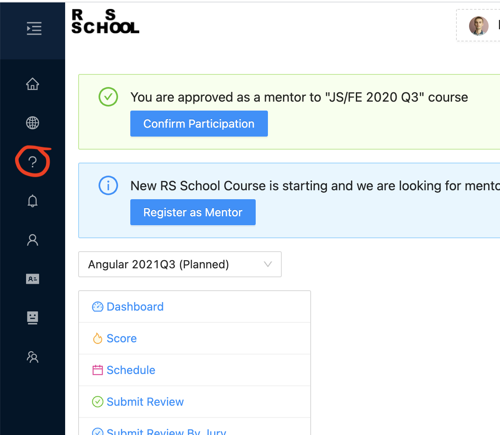
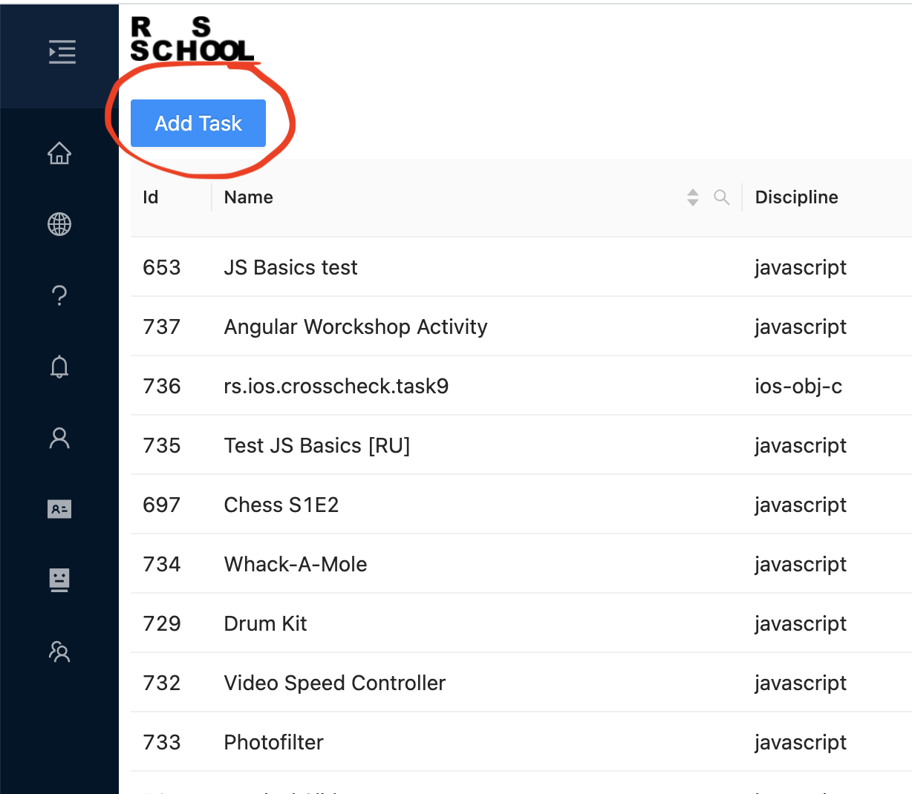
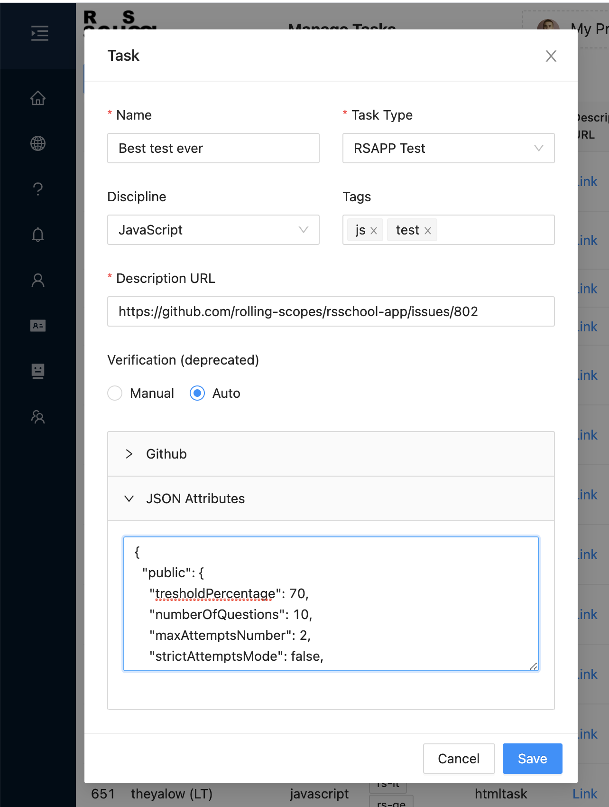
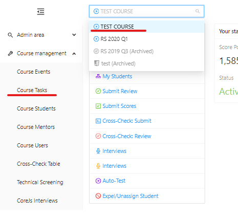
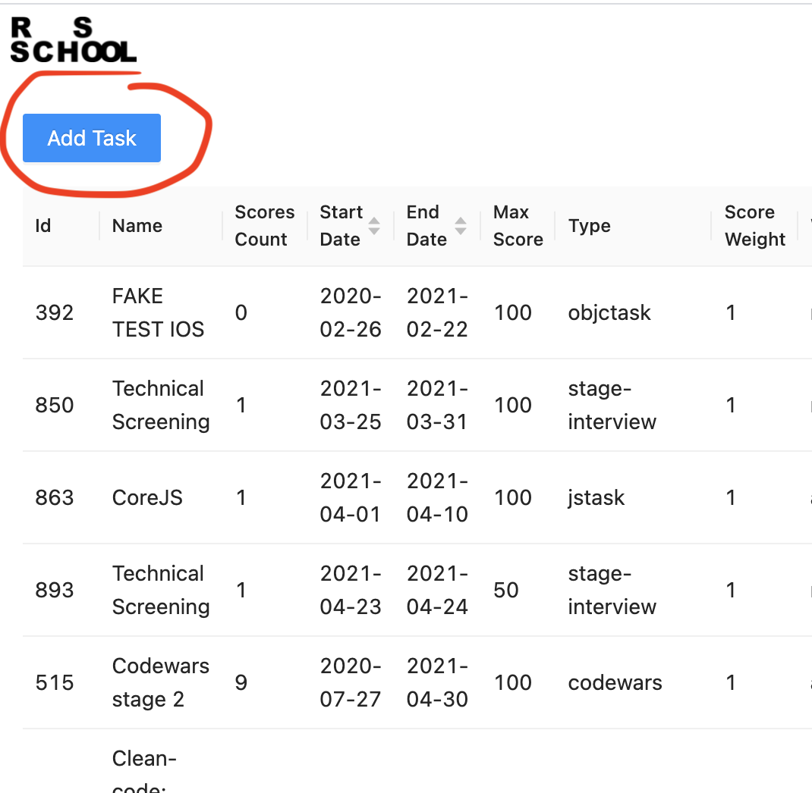
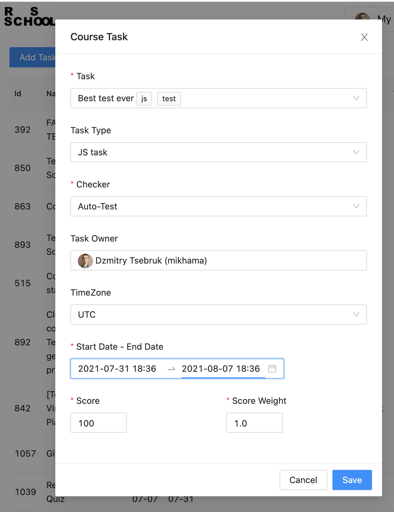
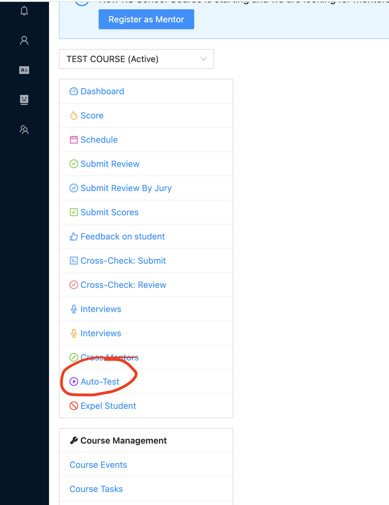
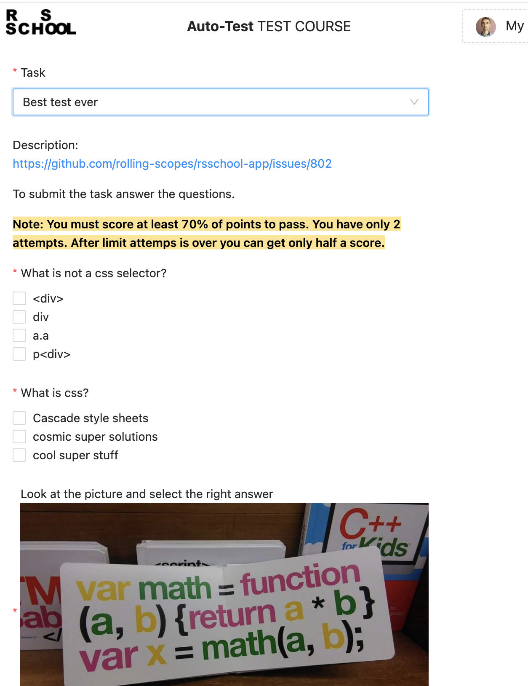

## Adding tests into RS School App (for trainers and admins only)

1. To add tests enter "Manage Tasks" page:
   

2. Then click "Add Task" button:
   

3. Fill in the form and save it:

   - "Name" - task title;
   - "Task Type" - select "RS School App Test";
   - "Discipline" - select course-related discipline;
   - "Tags" - set tags (optional) to highlight which aspect of the course it is related to. For example, "javascript", "html/css", etc.;
   - "Description URL" - link to the task description;
   - "JSON Attributes" - copy JSON file's content with test settings, questions and possible answers ([see below](https://docs.app.rs.school/#/adding-tests?id=json-attributes)).

   

4. In the course menu select "Course Tasks":
   

5. Click "Add Task" button too:
   

6. Fill in the form again and save it:

   - "Task" - select the task you have just created;
   - "Task Type" - select "RS School App Test";
   - "Checker" - select "Auto-Test";
   - "Task Owner" - select a person, who is responsible for this task;
   - "Start Date - End Date" - set a date of issuing the task and the deadline;
   - "Score" - set a maximum score a student can get for this task;
   - "Score Weight" - task weight (1 by default). It is needed for the manager of the course to correct it later, so do not change it.
     

7. The task is added! Go back to the course menu and select "Auto-Test" in order to check if the task has been added or not.
   
8. Select the test you have created in the drop-down list and check if anything wrong:
   

### JSON Attributes

#### Parameters:

- "strictAttemptsMode" - strict mode by default, set "false" to switch off the strict mode.
- "maxAttemptsNumber" - in the strict mode, after a certain amount of submissions, a student gets 0; otherwise, a student can submit it as many times as possible, but the score will be divided by 2.
- "numberOfQuestions" - number of questions (it must be equal to the length of arrays of "answers" and "public"."questions").
- "tresholdPercentage" - the percentage a student needs to reach for the task to be accepted (otherwise he gets 0 and loses 1 trial).
- "oneAttemptPerNumberOfHours" - if number is positive integer than submit will be restricted by 1 attempt per amount of the given number of hours, 0 is used by default and means that this option is disabled.
- "public"."questions" - questions and answers. To add a multi-choice question, set "true" for "multiple".
- "answers" - an array of numbers of correct answers (the order of numbers must be equal to the order in "public"."questions"!).

NB! student's resubmission implies he/she gets the last score obtained; it is possible to get 0, finally.

#### An Example:

    {
        "public": {
            "tresholdPercentage": 70,
            "numberOfQuestions": 10,
            "maxAttemptsNumber": 2,
            "strictAttemptsMode": false,
            "questions": [
                {
                    "question": "Do you like html?",
                    "answers": ["Yes", "No", "Maybe"],
                    "multiple": false
                },
                {
                    "question": "What is css?",
                    "answers": ["Cascade style sheets", "cosmic super solutions", "cool super stuff"],
                    "multiple": true
                },
                {
                    "question": "What is not a css selector?",
                    "answers": ["
", "div", "a.a", "p
"],
                    "multiple": true
                }
            ]
        },
        "answers": [
            [0],
            [0, 2],
            [0, 3]
        ]
    }

#### PRs for test functionality with added descriptions and examples

- [Basic example (see above)](https://github.com/rolling-scopes/rsschool-app/pull/530)
- [If you need pictures for tests](https://github.com/rolling-scopes/rsschool-app/pull/798)
- [If you need to restrict attempts per number of hours](https://github.com/rolling-scopes/rsschool-app/issues/1053)
